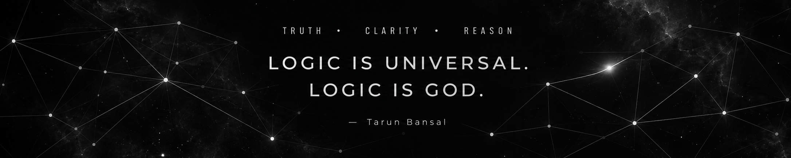

  

   
  <strong>Building reliable cloud infrastructure, automating delivery, and applying logic to complex systems.</strong>

   
  

---

## About Me

I'm a DevOps Engineer focused on **building reliable cloud infrastructure, automating delivery, and embedding security into engineering workflows**.

* ☁️ **Designing** cloud infrastructure and networking with **Microsoft Azure**
* 🏗️ **Building** reproducible infrastructure with **Terraform & Bicep**
* 🔄 **Automating** CI/CD workflows with **GitHub Actions & Azure DevOps**
* 🔐 **Integrating** security scanning and DevSecOps practices into delivery pipelines
* 📦 **Working with** containers, **Kubernetes**, and platform tooling
* 🤖 **Exploring** AI-assisted DevOps and platform engineering
* 🧠 **Applying** clarity, reasoning, and automation to complex engineering problems

---

## 🛠️ Technologies & Tools

### ☁️ Cloud

  
  

### 🏗️ Infrastructure as Code

  
  

### 🔄 CI/CD & Version Control

  
  
  
  

### 📦 Containers & Orchestration

  
  
  

### 🔐 DevSecOps

  
  
  
  
  

### 📊 Monitoring & Observability

  
  

### ⚙️ Automation & Scripting

  
  
  

---

## 🚀 Featured Projects

<!-- Replace these with your actual repositories -->

| Project | Description |
|---|---|
| 🔹 **Azure Landing Zone** | Azure infrastructure and networking foundation using Infrastructure as Code |
| 🔹 **DevSecOps Pipeline** | CI/CD pipeline integrating security and infrastructure validation |
| 🔹 **Terraform Labs** | Practical Terraform modules, patterns, and Azure infrastructure |
| 🔹 **Git & DevOps Learning** | Practical Git, GitHub and DevOps workflows |

---

## 🔗 Connect With Me

 &nbsp; &nbsp;

---

## 📊 GitHub Activity

  
  

  

---

## 🐍 Contribution Graph

  

---

## 🧠 Philosophy

  <b>TRUTH • CLARITY • REASON</b>

  <i>Technology changes.</i> 
  <i>Principles remain.</i>

  <b>LOGIC IS UNIVERSAL.</b> 
  <b>LOGIC IS GOD.</b>

---

  <i>Build it. Break it. Understand it. Automate it.</i>

---
