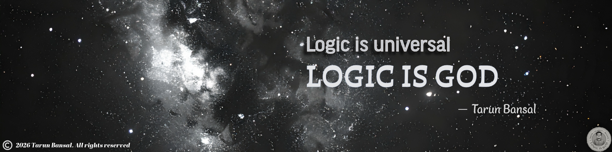

  

<h2 align="center">👋 Hi, I'm Tarun Bansal</h2>

  <b>DevOps Engineer • Azure • Infrastructure as Code • CI/CD • DevSecOps • Automation</b>

  <i>Building reliable cloud infrastructure, automating delivery, and applying logic to complex systems.</i>

---

## About Me

I'm a DevOps Engineer focused on **cloud infrastructure, automation, CI/CD, and DevSecOps**.

- ☁️ Working with **Microsoft Azure** and cloud-native infrastructure
- 🏗️ Building infrastructure with **Terraform & Bicep**
- 🔄 Designing and automating **CI/CD pipelines**
- 🔐 Integrating **DevSecOps and security scanning** into delivery workflows
- 📦 Working with **containers and Kubernetes**
- 🤖 Exploring **AI-assisted DevOps and platform engineering**
- 🧠 Applying **clarity, reasoning, and automation** to engineering problems

---

## 🛠️ Technologies & Tools

### ☁️ Cloud
**Azure**

### 🏗️ Infrastructure as Code
**Terraform • Bicep**

### 🔄 CI/CD & Version Control
**Git • GitHub • GitHub Actions • Azure DevOps**

### 📦 Containers & Orchestration
**Docker • Kubernetes • Helm**

### 🔐 DevSecOps
**Checkov • Semgrep • Trivy • Gitleaks • TFLint**

### 📊 Monitoring & Observability
**Prometheus • Grafana**

### ⚙️ Automation & Scripting
**PowerShell • Bash • Python**

---

## 🔗 Connect With Me

---

## 📊 GitHub Activity

  
  

  

---

## 🚀 Featured Projects

<!-- Replace these with your actual repositories -->

| Project | Description |
|---|---|
| 🔹 **Azure Landing Zone** | Azure infrastructure and networking foundation using Infrastructure as Code |
| 🔹 **DevSecOps Pipeline** | CI/CD pipeline integrating security and infrastructure validation |
| 🔹 **Terraform Labs** | Practical Terraform modules, patterns, and Azure infrastructure |
| 🔹 **Git & DevOps Learning** | Practical Git, GitHub and DevOps workflows |
| 🔹 **Kubernetes Labs** | Container orchestration and cloud-native experiments |

---

## 🐍 Contribution Graph

  

---

## 🧠 Philosophy

  <b>Truth • Clarity • Reason</b>
    
  <i>Technology changes.</i>
   
  <i>Principles remain.</i>
    
  <b>Logic is Universal.</b>
   
  <b>LOGIC IS GOD.</b>

